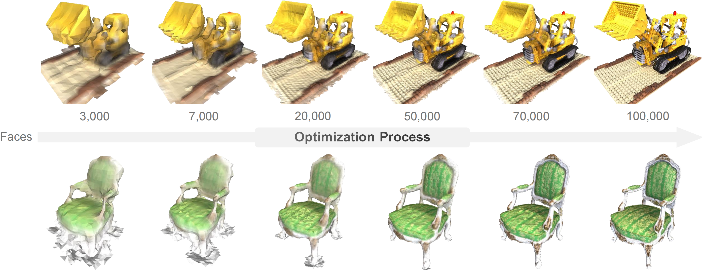

<div align="center">

# ExMesh: EXplicit Mesh Reconstruction with Topology Adaptation

**CVPR 2026**   
Chuanjin Fan, Lifan Wu, Wenjie Chang, Hanzhi Chang, Wenfei Yang, and Tianzhu Zhang  
University of Science and Technology of China

<div align="center">
  <a href="https://arxiv.org/abs/2606.07288">
    
  </a>
  <a href="https://fan-treasure.github.io/ExMesh_page.github.io/">
    
  </a>
</div>

<br>



</div>

This repository contains the official implementation for the paper **"ExMesh: EXplicit Mesh Reconstruction with Topology Adaptation"**.

## 📦 Installation

Please follow the steps below to set up the environment.

```bash
# Clone the repository
git clone https://github.com/YourUsername/ExMesh.git
cd ExMesh

# Create environment
conda create -n exmesh python=3.11
conda activate exmesh

# Set CUDA environment variables (adjust CUDA version/path as needed)
export CUDA_HOME=/usr/local/cuda-12.1
export PATH=$CUDA_HOME/bin:$PATH
export LD_LIBRARY_PATH=$CUDA_HOME/lib64:$LD_LIBRARY_PATH

# Install PyTorch (adjust cuda version if needed)
pip install torch torchvision torchaudio --index-url https://download.pytorch.org/whl/cu121

# Install dependencies
pip install -r requirements.txt

# Install submodules and external libraries
pip install git+https://github.com/NVlabs/nvdiffrast/ --no-build-isolation
pip install "git+https://github.com/facebookresearch/pytorch3d.git" --no-build-isolation
pip install PGSR/submodules/diff-plane-rasterization --no-build-isolation
pip install PGSR/submodules/simple-knn --no-build-isolation
```

## 📂 Data Preparation

### 1. Download Datasets
*   **DTU Dataset**: We use the 2DGS preprocessed version. Download it from [here](https://drive.google.com/drive/folders/1SJFgt8qhQomHX55Q4xSvYE2C6-8tFll9).
*   **DTU Ground Truth**: Download the ground truth point clouds from the [official DTU website](https://roboimagedata.compute.dtu.dk/?page_id=36).

### 2. Depth Estimation
We use [Depth Anything 3 (DA3)](https://github.com/ByteDance-Seed/depth-anything-3) for monocular depth estimation.

**You can choose one of the following approaches:**

- **Recommended (No DA3 environment required):**  
  Download our precomputed [DTU depth estimation results](https://drive.google.com/file/d/1KupSX6O1Ocq3N0n-V1_dNKCenA_eDRCm/view?usp=sharing) and extract them to the corresponding dataset directory.

- **Custom (Run DA3 yourself):**  
  If you wish to generate depth maps yourself, please follow the [official DA3 instructions](https://github.com/ByteDance-Seed/depth-anything-3) to set up the environment, then run our script:
  ```bash
  python scripts/da3_dtu_colmap.py
  ```

### 3. Organize Data
Organize the dataset folder as follows:

```
workdir
├── DTU
│   ├── scan24
│   │   ├── images
│   │   ├── mask
│   │   ├── sparse
│   │   ├── mono_priors
│   │   │   ├── da3
│   │   ├── cameras_sphere.npz
│   │   └── cameras.npz
│   │── ...
│   ├── Points      # GT Point Clouds
│   │   └── stl
│   └── ObsMask
```

## 🚀 Training and Evaluation

The training pipeline consists of two stages: **Coarse Mesh Initialization** and **ExMesh Optimization**.

### 1. Coarse Mesh Initialization
To obtain stable reconstruction results, we recommend using [PGSR](https://github.com/zju3dv/PGSR) with 5000 iterations for mesh initialization. Users may also choose [2DGS](https://github.com/hbb1/2d-gaussian-splatting), [Triangle Splatting](https://github.com/trianglesplatting/triangle-splatting), or other initialization methods according to their preference.

Run PGSR for 5000 iterations to initialize the mesh:

```bash
cd PGSR

# Train PGSR 2DGS model (about 2 minutes)
# Example for scan24
python train.py -s ../workdir/DTU/scan24 -m ../outputs/test --quiet -r2 --ncc_scale 0.5

# Extract coarse mesh
python render.py -m ../outputs/test --quiet --num_cluster 1 --voxel_size 0.01 --max_depth 5.0

# Copy the mesh for ExMesh initialization (Replace {scene} with scan ID, e.g., 24)
cp ../outputs/coarse_meshes_filtered/dtu_scan24/test/mesh/tsdf_fusion_post.ply ../workdir/DTU/scan24/mesh.ply

cd ..
```

### 2. ExMesh Training
Refine the mesh with topology adaptation.

```bash
# Train ExMesh
python train.py -s workdir/DTU/scan24 -m outputs/DTU/scan24
```

### 3. Evaluation
Evaluate the reconstructed mesh quality using standard metrics.

#### Single Scene Evaluation
```bash
python scripts/eval_dtu/evaluate_single_scene.py \
    --input_mesh outputs/DTU/scan24/mesh/auto_mesh_iter_8000.ply \
    --scan_id 24 \
    --output_dir outputs/DTU/scan24/eval \
    --mask_dir workdir/DTU \
    --DTU workdir/DTU
```

#### Full Dataset Evaluation
To train and evaluate on the entire DTU dataset automatically:

First, run PGSR to initialize coarse meshes for all scenes:
```bash
python PGSR/scripts/run_dtu_init.py
```

Then, run ExMesh training and evaluation:
```bash
python scripts/run_dtu.py
```

## 🤝 Acknowledgements

This project is built upon [2DGS](https://surfsplatting.github.io/) and [PGSR](https://zju3dv.github.io/pgsr/). We utilize [nvdiffrast](https://github.com/NVlabs/nvdiffrast) for differentiable rendering and [Depth Anything 3](https://github.com/ByteDance-Seed/depth-anything-3) for depth priors. We thank the authors for their open-source contributions.

## 📜 Citation

If you find this code useful for your research, please use the following BibTeX entry:

```bibtex
@inproceedings{Fan2026ExMesh,
  title={ExMesh: EXplicit Mesh Reconstruction with Topology Adaptation},
  author={Chuanjin Fan and Lifan Wu and Wenjie Chang and Hanzhi Chang and Wenfei Yang and Tianzhu Zhang},
  booktitle={Proceedings of the IEEE/CVF Conference on Computer Vision and Pattern Recognition (CVPR)},
  year={2026},
  url={https://fan-treasure.github.io/ExMesh_page.github.io/}
}
```
